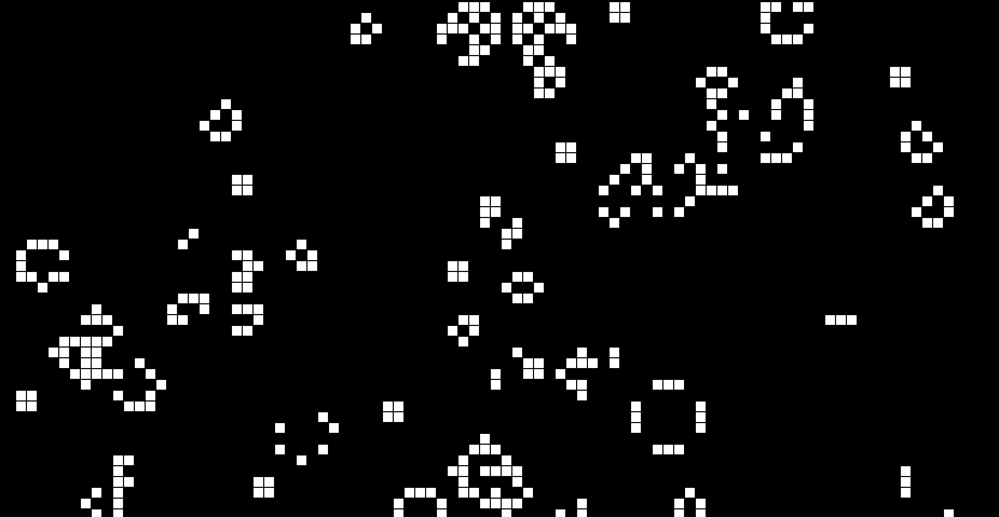

# gameOfLife
This project is based out of [Conway's Game of Life](https://en.wikipedia.org/wiki/Conway%27s_Game_of_Life).
It is made by using Processing p5.js. 

The basic rules are:
1. Any live cell with fewer than two live neighbours dies, as if caused by underpopulation.
2. Any live cell with two or three live neighbours lives on to the next generation.
3. Any live cell with more than three live neighbours dies, as if by overpopulation.
4. Any dead cell with exactly three live neighbours becomes a live cell, as if by reproduction.

Here's how the result looks like right now:

Current functionalities:
- Press R for random
- Press C for clearing screen
- Press Right arrow for staring
- Press Left arrow for stopping

Planed functionalities:
- Different colours for live "objects"
- Able to add different races see [wiki](https://en.wikipedia.org/wiki/Conway%27s_Game_of_Life)
- Random seeds
